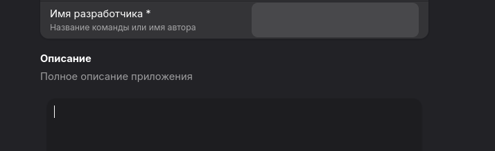

- Неверное назание ID приложения: io.github.user.appstreamcreator
Можно глянуть [тут](https://developer.gnome.org/documentation/tutorials/application-id.html)

- Неясно, зачем main.css файл. Он подгружается [здесь](/src/window.vala#L354), при выполнении получаем ошибку
```
(appstream_creator_app:1386248): Gtk-WARNING **: 16:18:57.302: Theme parser error: <broken file>:1:1: The resource at “/io/github/user/appstreamcreator/style/main.css” does not exist
```

Вместо ручной загрузки, можно по необходимости использовать style.css
Можно глянуть [тут](https://gnome.pages.gitlab.gnome.org/libadwaita/doc/1-latest/class.Application.html)
(Также неясно, зачем тут style.css вообще нужен)

- Некорректное использование виджетов. Следует изучить:
https://gnome.pages.gitlab.gnome.org/libadwaita/doc/1-latest/index.html
https://docs.gtk.org/gdk4/index.html
для референсов. Также есть приложения по типу Adw Demo и Gtk Demo для просмотра виджетов в библиотеках.

Для строки с текстом нужно использовать [Adw.EntryRow](https://gnome.pages.gitlab.gnome.org/libadwaita/doc/1-latest/class.EntryRow.html).

- Не выровнены виджеты


- OARS - это возрастной рейтинг и он это не свич, есть [генератор](https://hughsie.github.io/oars/generate.html), который можно добавить в приложение

- У `Скриншоты` и `Релизы` не убрана возможность выделения, которую отключают при использования Gtk.ListBox c `boxed-list` в качестве контейнера для строк.

- Кнопка генерации не нужна, можно генерировать при изменении полей. (также не думаю, что предпросмотр вообще нужен. Лучше помечать стилем `error` некорректные поля)

- Лицензии на метаданные лучше получать их из [Gtk.License](https://docs.gtk.org/gtk4/enum.License.html)

- Неочевидно, какие поля обязательные, а какие нет во время заполенния самих метаданных.

- Интерфейс не меняется при изменении типа компонента.

- Нет проверки валидности ID приложения.

- Неясно, зачем [этот файл](data/io.github.user.appstreamcreator.service.in)

- Некорректный файл [сборки](io.github.user.appstreamcreator.json)

- Не хватает в [схеме](data/io.github.user.appstreamcreator.gschema.xml) размера окна и его состояния.

- Интерфейс неадаптивен, следует ознакомится с [документацией](https://developer.gnome.org/hig/guidelines/adaptive.html).
И глобально с [этим](https://developer.gnome.org/hig/guidelines.html)

- [Такой](src/gtk/help-overlay.ui) формат help устарел, следует использовать [это](https://gnome.pages.gitlab.gnome.org/libadwaita/doc/main/class.ShortcutsDialog.html)

- Вместо libxml2 лучше использовать gxml, так как имеет лучший объектный биндинг для Vala.

- Файл с [интерфейсом](src/window.ui) есть, но не используется. Следует перенести интерфейс в файлы интерфейса, но использовать не .ui, а .blp формат. https://gnome.pages.gitlab.gnome.org/blueprint-compiler/

- Можно писать неймспейс перед классом, чтобы не писать лишний текст:
```
namespace AppstreamCreatorApp {

public class Window : Adw.ApplicationWindow {
```
```
public class AppstreamCreatorApp.Window : Adw.ApplicationWindow {
```

- private слово необязательно, всё по-умолчанию private

- [Здесь](/src/window.vala#L20) лучше использовать Object конструктор со свойствами 
```
AppstreamData data;

public Window (Gtk.Application app) {
    Object (application: app);
    this.data = new AppstreamData ();
}
```
```
public AppstreamData data { get; construct; }

public Window (Gtk.Application app) {
    Object (
        application: app,
        data: new AppstreamData ()
    );
}
```

- Переводы есть в po, но строки на русском языке, а метки переводов отсутствуют.

- В загаловке лучше не использовать кнопки с текстом (тем более со стилем `pill`), а использовать кнопки с символьными иконками.
